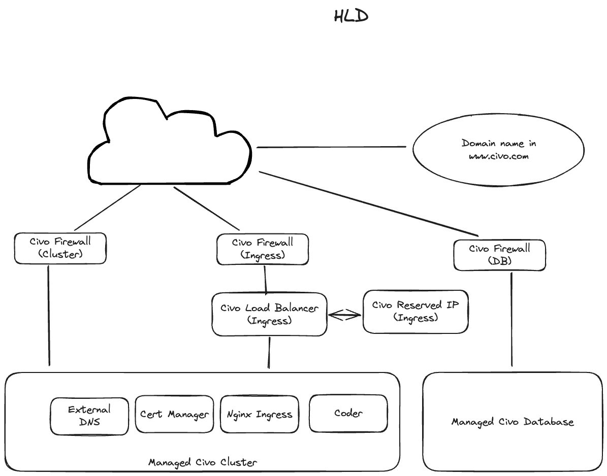

# Civo Coder Install

This is a reference install for running [Coder](https://coder.com) on [Civo](https://civo.com).

This uses terraform to install:

- Civo Managed Database
- Civo Managed Kubernetes Cluster
- Coder
- Cert Manager
- Nginx Ingress
- External DNS



## Pre-requisites

- Create an account on civo.com
- Add a domain to civo.com
- Install terraform

## Step by Step

There is a python notebook at [run book](./runbook.ipynb) that steps through each phase of the install and provides some commentary about what is being installed at each step. To learn about the details about each item being installed, this is the best place to start

## Running Atomically

As this relies on terraform, the install can be done in one step with:

1. Create a `terraform.tfvars` file from `terraform.tfvars.sample`
2. Add domain, civo api credentials to the `terraform.tfvars` file
3. Run:
   ```bash
   terraform init --upgrade
   terraform apply
   ```


# Out of Scope

- The state file is stored locally, which is fine for a demo but should be moved to a remote backend for production.